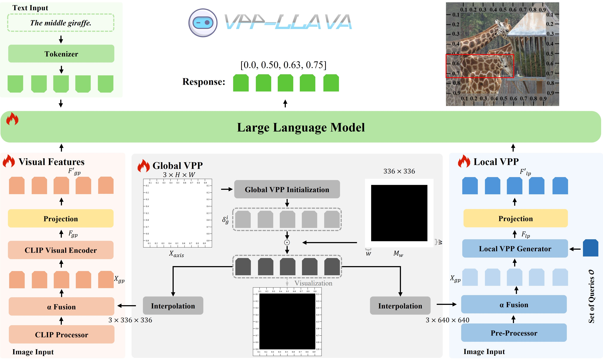
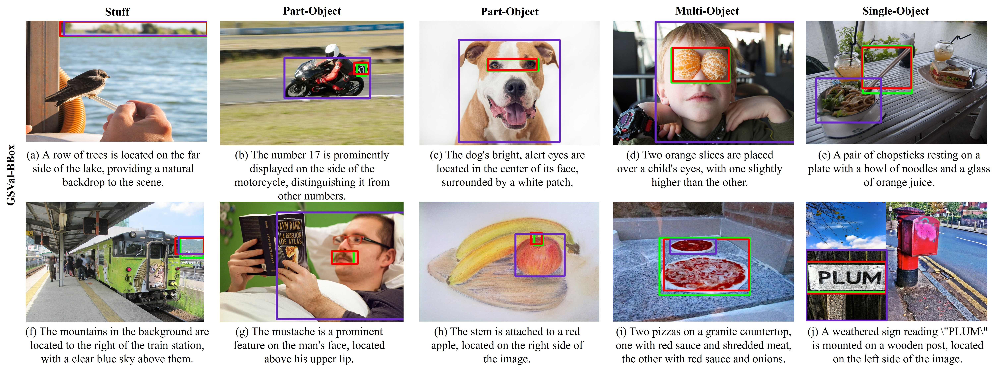

#  [Visual Position Prompt for MLLM based Visual Grounding](https://arxiv.org/abs/2503.15426)
<!-- <p align="center" width="100%">
</p> -->

<div>
<div align="center">
    <a href='https://scholar.google.com/citations?user=D-27eLIAAAAJ&hl=zh-CN' target='_blank'>Wei Tang<sup>*,1,2</sup></a>&emsp;
    <a href='https://scholar.google.com.hk/citations?user=a3FI8c4AAAAJ&hl=zh-CN' target='_blank'>Yanpeng Sun<sup>1</sup></a>&emsp;
    <a href='https://scholar.google.com.hk/citations?user=a3FI8c4AAAAJ&hl=zh-CN' target='_blank'>Qinying Gu<sup>&#x2709,2</sup></a>&emsp;
    <a href='https://scholar.google.com/citations?user=L6J2V3sAAAAJ&hl=zh-CN' target='_blank'>Zechao Li<sup>&#x2709,1</sup></a>
</div>
<div>
<div align="center">
    <sup>1</sup>Nanjing University of Science and Technology;
    <sup>2</sup>Shanghai Artificial Intelliaence Laboratory&emsp;
    </br>
    <sup>&#x2709</sup> Corresponding Author
    </br>
    <sup>*</sup> This work was done during his internship at Shanghai Artificial Intelliaence Laboratory.
    
</div>
 
 -----------------

[](https://github.com/tatsu-lab/stanford_alpaca/blob/main/LICENSE)


## 💥 News
-  **7 Jul, 2025**: :boom::boom: All our VPP-LLaVA code and checkpoints have been released on GitHub and Huggingface, respectively: [[🤗 VPP-LLaVA-7b](https://huggingface.co/wayneicloud/VPP-LLaVA-7b)] and [[🤗 VPP-LLaVA-13b](https://huggingface.co/wayneicloud/VPP-LLaVA-13b)]
-  **30 Jun, 2025**: :boom::boom: The new version of our paper has been released: [[VPP-LLaVA paper](https://arxiv.org/pdf/2503.15426)]. Our method shows strong zero-shot capability on the more complicated dataset of GSEval-BBox, especially when dealing with part-object and multi-object scenarios.
-  **27 Apr, 2025**: :boom::boom: Our VPP-SFT dataset and the ablation 150K dataset have been released to Huggingface [[🤗 Huggingface Dataset](https://huggingface.co/datasets/wayneicloud/VPP-SFT/tree/main)]
- **19 Mar, 2025**: :boom::boom:  Our paper "Visual Position Prompt for MLLM based Visual Grounding" has been submitted to IEEE Transactions on Multimedia (TMM).

## 🏆 About VPP-LLaVA


Although Multimodal Large Language Models (MLLMs) excel at various image-related tasks, they encounter challenges in precisely aligning coordinates with spatial information within images, particularly in position-aware tasks such as visual grounding. This limitation arises from two key factors. First, MLLMs lack explicit spatial references, making it difficult to associate textual descriptions with precise image locations. Second, their feature extraction processes prioritize global context over fine-grained spatial details, leading to weak localization capability. To address these issues, we introduce VPP-LLaVA, an MLLM enhanced with Visual Position Prompt (VPP) to improve its grounding capability. VPP-LLaVA integrates two complementary mechanisms: the global VPP overlays a learnable, axis-like tensor onto the input image to provide structured spatial cues, while the local VPP incorporates position-aware queries to support fine-grained localization. To effectively train our model with spatial guidance, we further introduce VPP-SFT, a curated dataset of 0.6M high-quality visual grounding samples. Designed in a compact format, it enables efficient training and is significantly smaller than datasets used by other MLLMs (e.g., ~21M samples in MiniGPT-v2), yet still provides a strong performance boost. The resulting model, VPP-LLaVA, not only achieves state-of-the-art results on standard visual grounding benchmarks but also demonstrates strong zero-shot generalization to challenging unseen datasets. Code and dataset will be released upon acceptance at https://github.com/WayneTomas/VPP-LLaVA.

## 👀 Examples of VPP-LLaVA

Our method shows strong zero-shot capability on the more complicated dataset of GSEval-BBox, especially when dealing with part-object and multi-object scenarios. In the visualizations, <span style="color:green">green</span> represents the ground truth (GT), <span style="color:red">red</span> represents our VPP-LLaVA-7B, and <span style="color:purple">purple</span> represents Qwen2.5-VL-7B.

## ⚙️ Install
1. Clone this repository and navigate to LLaVA folder
```bash
git clone https://github.com/WayneTomas/VPP-LLaVA.git
cd VPP-LLaVA
```

2. Install Package
```Shell
conda create -n vpp-llava python=3.10 -y
conda activate vpp-llava
pip install --upgrade pip  # enable PEP 660 support
pip install -e .
```

3. Install additional packages for training cases
```
pip install -e ".[train]"
```

4. Install flash-attention v2

You can install `flash-attention` using the following command:
```bash
pip install flash-attn --no-build-isolation
```
However, if you encounter any issues with this method, we recommend downloading the specific version of the flash-attention wheel file from the [Releases page](https://github.com/Dao-AILab/flash-attention/releases) and installing it manually. For example, you can download the flash_attn-2.7.0.post2+cu12torch2.1cxx11abiFALSE-cp310-cp310-linux_x86_64.whl file and install it using the following command:
```Shell
pip install flash_attn-2.7.0.post2+cu12torch2.1cxx11abiFALSE-cp310-cp310-linux_x86_64.whl
```
### Upgrade to latest code base

```Shell
git pull
pip install -e .

# if you see some import errors when you upgrade,
# please try running the command below (without #)
# pip install flash-attn --no-build-isolation --no-cache-dir
```

### Quick Start With HuggingFace
<details>
<summary>Example Code</summary>

```Python
from llava.model.builder import load_pretrained_model
from llava.mm_utils import get_model_name_from_path

model_path = "checkpoints/llava-vpp-7b"

tokenizer, model, image_processor, context_len = load_pretrained_model(
    model_path=model_path,
    model_base=None,
    model_name=get_model_name_from_path(model_path)
)
```

Check out the details wth the `load_pretrained_model` function in `llava/model/builder.py` and the example code of visual grounding llava/eval/refcoco_all/model_refcoco_loader.py.
</details>

## 🛠️ Visual Instruction Tuning
1. Prepare data

Please download the annotation of the final mixture our instruction tuning data [llava_v1_5_GRD_Chatterbox_genixer_revised.json](https://huggingface.co/datasets/wayneicloud/VPP-SFT/blob/main/llava_v1_5_GRD_Chatterbox_genixer_revised.json), and download the images from constituting datasets:

- COCO: [train2017](http://images.cocodataset.org/zips/train2017.zip)
- LLaVA-Pretrain: [LLaVA-Pretrain](https://huggingface.co/datasets/liuhaotian/LLaVA-Pretrain).
- VisualGenome: [part1](https://cs.stanford.edu/people/rak248/VG_100K_2/images.zip), [part2](https://cs.stanford.edu/people/rak248/VG_100K_2/images2.zip)
- ReferIt: Due to some limitations, please search and down it by yourself.
- GSEval: Please refer to [GSEval](https://huggingface.co/datasets/hustvl/GSEval) for more details.

After downloading all of them, organize the data as follows in `./playground/data`,

```
├── coco
│   └── train2017
├── LLaVA-Pretrain
│   └── images
├── referit (for open-vocabulary test, optional)
│   └── images
└── vg
    ├── VG_100K
    └── VG_100K_2
```

2. Start training!

You may download original LLaVA-v1.5 of liuhaotian's pretrained models in [Model Zoo](https://huggingface.co/collections/liuhaotian/llava-15-653aac15d994e992e2677a7e)

Training script with DeepSpeed ZeRO-3: [`con_sft.sh`](https://github.com/WayneTomas/VPP-LLaVA/tree/master/scripts/vpp-llava/con_sft.sh).

If you are do not have enough GPU memory:
<details>
<summary>LoRA</summary>
  
  **Note**: We have not modified the original LLaVA-v1.5 code for LoRA training, so theoretically it remains unchanged. However, since we have not tested LoRA training, please refer to the original LLaVA GitHub repository for solutions.
If you are interested in finetuning LLaVA model to your own task/data, please check out [`Finetune_Custom_Data.md`](https://github.com/haotian-liu/LLaVA/blob/main/docs/Finetune_Custom_Data.md).
</details>

New options to note:

- `--unfreeze_mm_vision_tower True`: set visual tower of CLIP to training mode.
- `--mm_vision_tower_lr ${VIT_LR}`: set the lr of visual tower to ${VIT_LR}, and the default value is 2e-6.

## 📊 Evaluation

In VPP-LLaVA, we primarily focus on the grounding task. For more details, please refer to the [VPP-LLaVA evaluation](https://github.com/WayneTomas/VPP-LLaVA/tree/master/llava/eval).

## 📝 Additional Notes
Our work is based on the visual position prompt method built upon LLaVA-v1.5. Therefore, the overall code structure is directly inherited from LLaVA. Except for the necessary modifications, the rest, including variable and package naming, remains consistent with the original LLaVA-v1.5 code.

Original Code: [llava_origianl](https://github.com/WayneTomas/VPP-LLaVA/tree/master/llava-ori).

Modified Code: [vpp-llava](https://github.com/WayneTomas/VPP-LLaVA/tree/master/llava).

Thus, if followers have already set up the environment for the original LLaVA version, they can simply copy the llava folder from our repository into the original LLaVA code.

<details>
<summary>Primary Modifications</summary>
The primary modifications in this project’s model are located in the following areas:

- **Main Model Architecture**:
  - [llava_arch.py](https://github.com/WayneTomas/VPP-LLaVA/blob/master/llava/model/llava_arch.py)
  - [llava_llama.py](https://github.com/WayneTomas/VPP-LLaVA/blob/master/llava/model/language_model/llava_llama.py) (modified `generate function` to `generate_custom function`)

- **Projector**:
  - [builder.py](https://github.com/WayneTomas/VPP-LLaVA/blob/master/llava/model/multimodal_projector/builder.py)

- **Visual Encoder**:
  - If you attempt to change the type or parameters of the visual encoder, please refer to the [multimodal_encoder](https://github.com/WayneTomas/VPP-LLaVA/tree/master/llava/model/multimodal_encoder) directory.
  - In addition to the default CLIP visual tower and the DETR visual encoder that we introduced, we have also included reference code for other encoders, which we hope will be helpful.

- **Training**:
  - [train.py](https://github.com/WayneTomas/VPP-LLaVA/blob/master/llava/train/train.py)
  - [llava_trainer.py](https://github.com/WayneTomas/VPP-LLaVA/blob/master/llava/train/llava_trainer.py)
  - Note: Pay special attention to the modifications in `train.py` from lines 697 to 776 regarding the extra encoder and related prompt data.
</details>

## 🌈 Acknowledgements
This repo is changed from [LLaVA v1.5](https://github.com/haotian-liu/LLaVA). The repo also benifits form [ChatterBox (AAAI 2025)](https://github.com/sunsmarterjie/ChatterBox) and [Genixer (ECCV 2024)](https://github.com/zhaohengyuan1/Genixer)

Thanks for their wonderful works.

## 📚 Cite

```bibtex
@misc{tang2025visualpositionpromptmllm,
      title={Visual Position Prompt for MLLM based Visual Grounding}, 
      author={Wei Tang and Yanpeng Sun and Qinying Gu and Zechao Li},
      year={2025},
      eprint={2503.15426},
      archivePrefix={arXiv},
      primaryClass={cs.CV},
      url={https://arxiv.org/abs/2503.15426}, 
}
```
```
paper link: https://arxiv.org/abs/2503.15426
```
